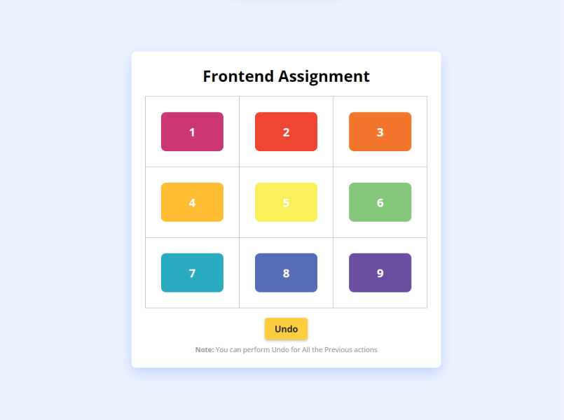

# Frontend Drag and Drop Assignment

**Goal:** Create drag & drop functionality to move Div elements from one cell to another in a table.

**Technology:** HTML, JavaScript, CSS

**Website Link:** https://frontend-assignment-drag-and-drop.netlify.app/

**My Final Implementation:**

**Key Features:**

1. Drag and drop box from any cell to any other cell.
2. The selected box moves with the cursor.
3. The selected box ( the one being dragged ) fades while being dragged.
4. The cells through which the box passes, gets highlighted by a different color background
5. All the moves are tracked and so we can Undo all the moves.
6. The undo button shows alert message if no Drag and Drop performed before clicking it.
